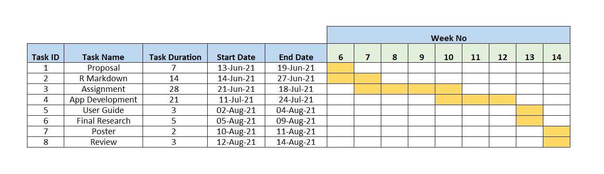

```{r setup, include=FALSE}
knitr::opts_chunk$set(echo = FALSE)
```
# INTRODUCTION

IEEE ```organises``` an annual Visual Analytics Science and Technology (VAST) Challenge with the goal to promote and push the application of visual analytics for individuals and teams through competition.  It has a variety of realistic analytic tasks and data sets for one to challenge their mind and skillsets. When solving the task, It will spur one to be innovative in data transformation and the application of visual analytic techniques so to develop insightful, interesting and interactive visualisation. VAST Challenge 2021 is [here](https://vast-challenge.github.io/2021/index.html). The challenge will set the foundation and opportunity for SMU students to test and benchmark one visual analytics technique.  

 

# MOTIVATION AND OBJECTIVES

We are motivated and honoured to pit our visual analytics techniques on this renowned VAST Challenge by adopting this programme as the foundation for our Visual Analytics Project. We are fascinated to solve the tasks using creative and innovative visualisation for storytelling to the best of our ability. The objectives are: 

 

1. Effective use of visual analytics techniques in approaching and solving the tasks. 

2. Offer insightful interesting and interactive visualisation with good clarity and aesthetics as part of storytelling in solving the task. 

 

# DATA AND TASKS

This project will focus on the mini-challenge 2 (MC2) from VAST Challenge 2021. It was designed based on a fictitious scenario where employee of a company went missing. And the data cover from loyalty card and credit card date to the vehicle GPS data: 

 

* A list of vehicle assignments by employee, in CSV format (car-assignments.csv) 

  + Employee Last Name 
  
  + Employee First Name 
  
  + Car ID (integer) 
  
  + Current Employment Type (Department; categorical) 
  
  + Current Employment Title (job title; categorical) 

* ESRI shapefiles of Abila and Kronos (in the Geospatial folder) 

* A CSV file of vehicle tracking data (gps.csv) 

  + Timestamp 
  
  + Car ID (integer) 
  
  + Latitude 
  
  + Longitude 

* A CSV file containing loyalty card transaction data (loyalty_data.csv) 

  + Timestamp 
  
  + Location (name of the business) 
  
  + Price (real) 
  
  + Loyalty Number (A 5-character code starting with L that is unique for each card) 

* A CSV file containing credit and debit card transaction data (cc_data.csv) 

  + Timestamp 
  
  + Location (name of the business) 
  
  + Price (real) 
  
  + Last 4 digits of the credit or debit card number 

* A tourist map of Abila with locations of interest identified, in JPEG format (MC2-Tourist.jpg) 

 

Based on the available datasets, we will complete several tasks: 

 

* Identify popular locations where the credit and loyalty card were used and some anomalies in usage 

* Anomalies after adding the vehicle data 

* Infer the owners of each credit and loyalty card and with evidence and uncertainties 

* Identify potential informal or unofficial relationships among personnel in the company 

* Identify suspicious activity and its location 

 

# APPROACH

This year, the project is a continuation for the module assignment where individual teammate will independently select one mini challenge to embark on.  Thereafter, the teammate will decide collectively on the project deliverables base on the assignment. For the project, the teammate will meet up based on the established timeline to share about their works to address the MC2 tasks.  

 

Through collective discussion, we would either select the best visualisation from individual effort on the respective task or design a new visualisation based on new insights gleaned from the discussion.  The discussion will also focus on deliberating on the best approach to storytelling team findings via an interactive visualisation in Shinny. Aim is to provide positive experience to one in exploring insights via Shinny.  The details on the techniques and visualisation will evolve over the assignment phase.  

 

### Software Tool 

 

This interactive application will be using R and the final report will be written using rmarkdown. 

 

The R packages used will include but not limited to: 

 

**Data Cleaning** 

 

lubridate: https://lubridate.tidyverse.org/ 

 

Tidyverse: https://www.tidyverse.org/ 

 

**General** 

 

readr: https://cran.r-project.org/web/packages/readr 

 

readxl: https://cran.r-project.org/web/packages/readxl 

 

tidyverse: https://www.tidyverse.org 

 

**Shiny and Visualization** 

 

DT: https://cran.r-project.org/web/packages/DT 

 

ggplot2: https://cran.r-project.org/web/packages/ggplot2/index.html 

 

shiny: https://shiny.rstudio.com 

 

shinythemes: https://cran.r-project.org/web/packages/shinythemes 

 

shinyWidgets: https://cran.r-project.org/web/packages/shinyWidgets 

 

shinydashboard: https://cran.r-project.org/web/packages/shinydashboard/index.html 

 

**Data Analysis** 

 

corrplot: https://cran.r-project.org/web/packages/corrplot 

 

purr: https://cran.r-project.org/web/packages/purrr/index.html 

 

rgdal: https://cran.r-project.org/web/packages/rgdal 

 

rgeos: https://cran.r-project.org/web/packages/rgeos 

 

# TIMELINE
 



