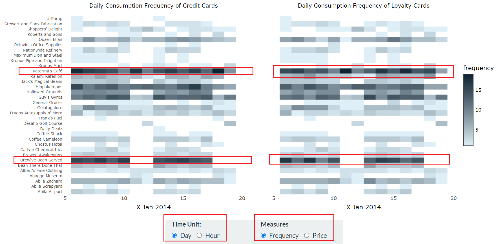
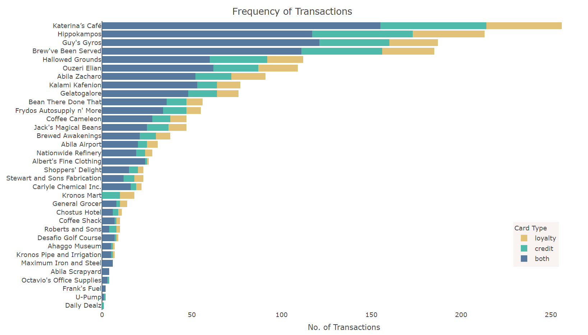
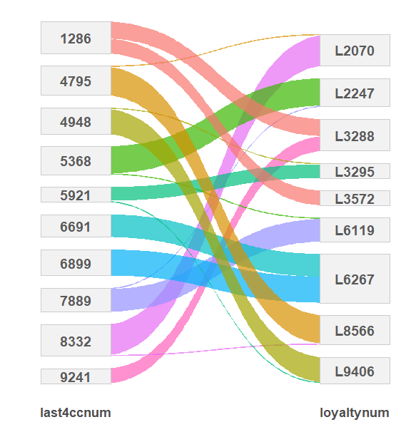
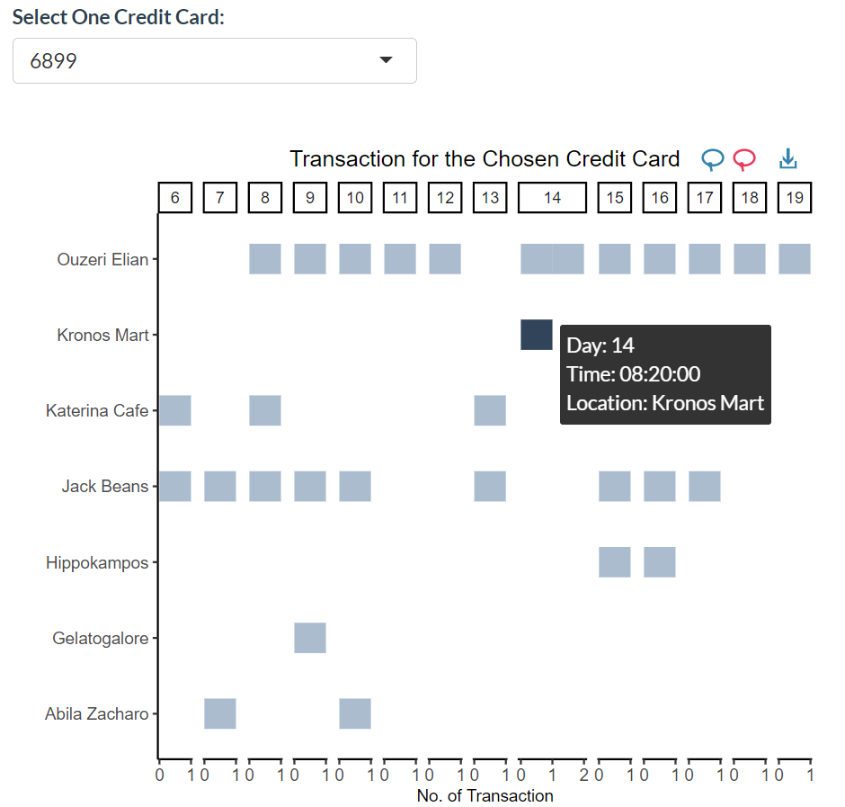
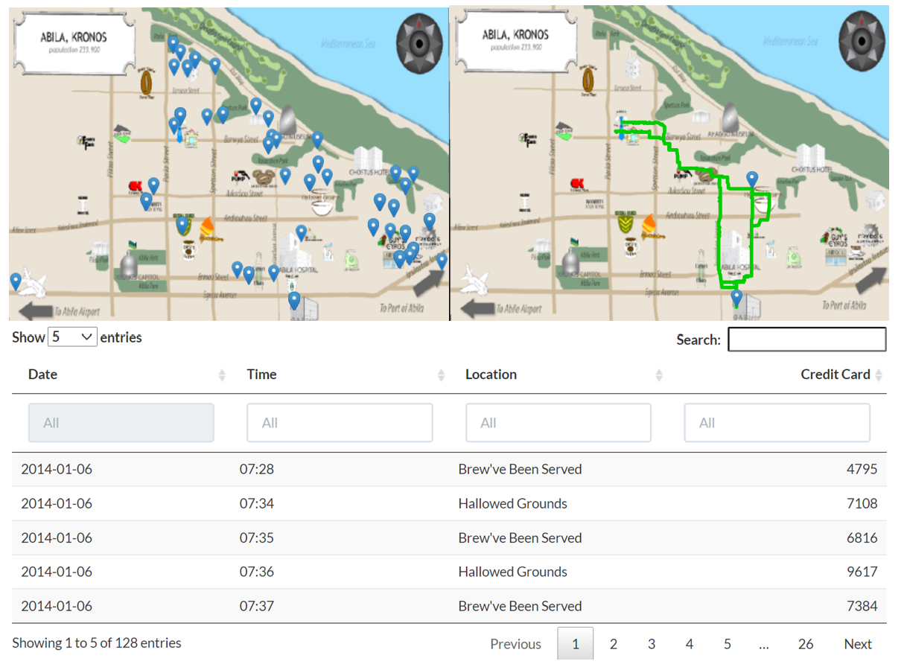
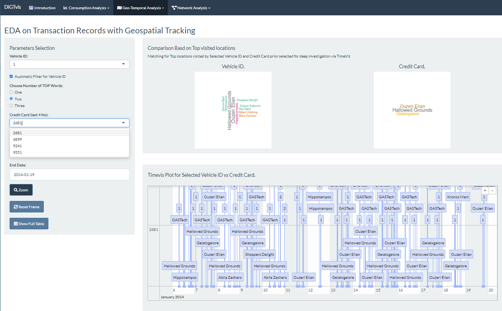
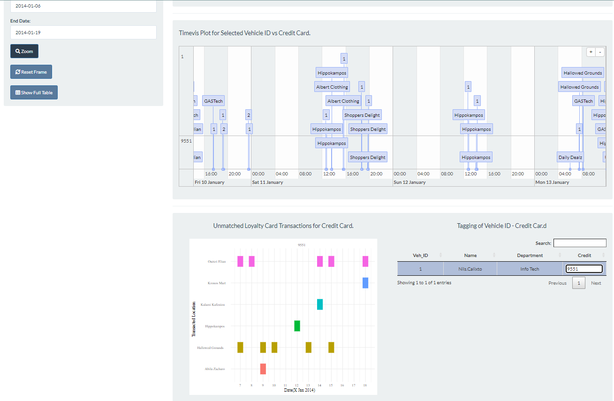
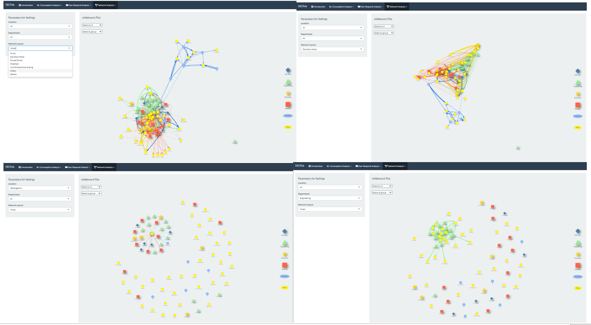
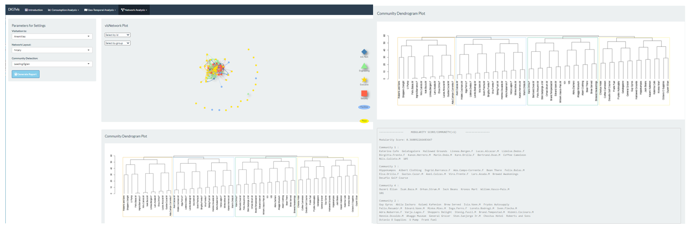

```{r, echo=FALSE,eval=FALSE}
install.packages("rticles")
library(rticles)
```

# INTRODUCTION 

The 2021 annual Visual Analytics Science and Technology (VAST) Challenge \href{https://vast-challenge.github.io/2021/index.html}{here} brough back a classic three mini-challenges to see how approaches and techniques of visual analytics have developed since the inception of the classic scenario in 2014.  VAST challenge consisted of three Mini-challenges (MC) that each has an accompany story and tasks to determine the ground truth. An overarching Grand challenge (GC) would then tie the ground truths to address an overarching challenge.  Solving each mini challenge would require the utility of different aspects of visual analytics, spur one to be innovative in data transformation and adopt interactive visualisation to discern impactful insights. This paper focused on the development of a web-based application to support an analysist in solving the Mini-challenge 2 (MC2).

# MOTIVATION AND OBJECTIVES

2021 VAST MC2 has four csv files, namely (1) credit card transaction, (2) loyalty card transaction (3) geospatial tracking data of company vehicle and (4) vehicle assignment and personnel data. The data was associated with temporal and/or geographical information related to transaction aspatial data. See Figure 1. 

  

The challenge generally used heterogeneous data sets where one was required to analysis, combines and associate. Each csv file was like a puzzle piece and solving the puzzle would be dependent on the ability to establish the links between the common metadata within the files (i.e. linking loyalty card – credit card – vehicle ID – personnel information).  Some puzzle could be solved by simple file merging operations while others, would require data transformation couple with visual analysis to establish the relationship. For example, linking credit card with vehicle ID might need to establish the geospatial value to the respective location prior the association via temporal attributes. It was imperative to determine the linkages among the dataset as it would establish the foundation layer to enable deeper analysis to address MC2 tasking. 

With all these challenges likely faced by an investigator, our research and development efforts were motivated to provide web-enabled client-based effective and high usability shiny visualisation dashboard that is to support the investigation efforts on geographical – temporal information with time-series dimension for 2021 VAST MC2 challenges.  Specifically, the Shiny app DiGTvis, Dynamic Interactive Geospatial-Temporal visualisation dashboard, aimed to achieve the following objectives:

1. An investigation framework to establish the geographical-temporal information that would chain the csv files into a common picture. 
2. A visualisation framework that would support Exploration Data Analysis into the dataset to discover MC2 ground truth.

# REVIEW ON PAST WORKS

The field of visual analytics has evolved into a complex hybrid of information visualization, interaction design, machine learning, and human psychology. Lina Yang et al 2019 has cited that the commonly used visualization for spatial-temporal data were mainly: (1) Statistical Charts - histograms, line charts evolved to word clouds, chord diagrams, and relation diagrams etc that were consistent and widely accepted to human perception and cognitive. (2) Visualisation Methods combined with Map – the ability to display spatial and timeliness attributes of spatial-temporal data to provide the richness in visualisation and comprehension. Typical visualisation like Scatter Charts and Aggregation Charts, Heat Map, etc.  Subsequently techniques like highlighting, scaling, fish-eye technology, association updating, and dynamic change were introduced to enhance interactive. 

As the dataset also has time series component, Yujie Fang et al 2020 explained that time series data has both time and data attributes. There were numerous ways of characterizing the time attributes. It could be separated into abstract and spatial features base on reference standard; low and high dimensional features based on number of variables; event and states based on data types. Visualisation of such data could be summarised into (1) visualising time attributes using Calendar view, Spiral diagram where time attributes could be displayed based on the required granularity; (2) high dimensional time series data like parallel coordinate with a time axis where it could show the process of changing data state and how respective dimension change overtime. However, excellent interaction was essential to maximise the impact created by visualisation. Interaction should design to engage user to improve comprehension and analysis of data.  One should be cognisant on the consideration in interaction design based on Shneiderman's principle of visual interaction and J.S. Yi et al 2007 on the seven comprehensive visual interaction methods. A review into the design of a highly interactive TimeViewer by Peter Weishap 2007 assessed it would be useful visualisation tool as it could support information visualisation where geographical information could be managed as an event in a temporal horizontal axis equipped with an interactive Fisheye View.  

Review on past works of similar MC2 challenges in VAST Challenge 2014 from \href{http://visualdata.wustl.edu/varepository/benchmarks.php}{Visual Analytic Benchmark Repositor} has indicated that the Centre South University (awarded for outstanding visualisation and analysis in 2014) had centred around the used of calendar view/parallel coordinated/Radvis combined with map as the visualisation method which echoed well with the review. However, one need to be cognisant that the dataset and tasks set in 2014 were also different from 2020 challenges even though quite similar visual analytics techniques on geographical-temporal dataset with time series dimension was needed. Moreover, VAST participants especially those from university, would generally use the challenge as a mean to validate their in-house visualisation tools (i.e.Radvis). 


# DESIGN FRAMEWORK
The application was mandated to use the free and open-source R language. R has its own comprehensive suite of libraries to support data processing to statistics and graphical analysis, visualisation and word processing.  The visual application was built using **Shiny** packages, which could build interactive web apps straight from R. Because the user interface components could be easily customized, and its server used reactive programming could provide the possibility of designing what one want. Given the development motivation, the application should design centred around the investigator needs and resolving any potential pain points. The design principals for the dashboard were as follow: 

* Provide clarity and aesthetics to ease cognitive processing
* Build thoughtful and high usability to reduce friction during usage
* Construct integrated visualisation to meet the needs of investigation
* Achieve dynamic and interactive to meet user’s needs, see more and deeper

Generally, the dashboard could have numerous sub-sections design in a sequential manner to support investigators in resolve the task. However, it was cardinal that respective section was designed with an integrated and interactive mindset that permissive an investigator to dynamically navigate around the section to discern insights beyond our predication. Such application design would provide greater value to investigators.

The typical data analytics workflow process of data preparation, interactive exploratory data analysis, analysis and insights discovery would be applied as normal. The application would leverage on numerous R libraries to create the required dynamic and interactive visualisation to allow investigators to discover the association between the metadata, cognitive ease, frictionless and impactful insights to ease tasks resolution. 

## DATA PREPARATION
Four datasets were extracted from VAST website where each focused on specific data attributes as in Figure 1. Limited cleaning was required as any “corrupted” data was intentional induced by VAST for the purpose of insights discovery. Transformation was done mainly focused on establishing consistency in datatype across the different sets and more importantly, easing the mapping and association of metadata for insight discovery. For instance, computing the time lap for geographical tracking data could determine locations where the vehicle has visited based on stationary duration. Other minor data wrangling such as rounding off the latitude and longitude values to less decimal place to ease mapping of location to geographical position; deriving the required day and time information from date time stamp to enhance the richness in visualisation etc. Necessary datasets were then joined together and processed to the required format and saved into R binary data files to facilitate ease of loading in shinyapps.io. The required format was particularly important to support visualisation especially for selected R packages. 

## SHINY ARCHITECTURE

The design of the Shiny application includes four components. (i) **Introduction** - Brief introduction and overview for the Shiny application. This tab provides information about story of GAStech company and the motivation of building this Shiny application. (ii) **Consumption Analysis** - This tab allowed one to conduct exploratory data analysis based on aspatial data such as transaction records with temporal information. It aimed to use visual analytics to show the popularity of locations by consumption amount or frequency. The outcome was to show popular locations, match credit card with loyalty card and summarize consumptions for one person or one location. (iii) **Geospatial Temporal Analysis**- There were two panels, and it was main analysis panel of the application.  It aimed to determine the credit card owner through geospatial temporal analysis. The tabs could also assist the investigator to discover insights associated with geospatial – temporal dimension or beyond. (iv) **Network Analysis** - There were two panels under this tab. It aimed to discover formal or informal relationship or activities based a network structure build from geospatial tracking data.  It offered richness in discovering insight associated with the network structure, but it generally lacked information associated with temporal dimension where the investigator has too dependent on pervious tabs. While each tab served to sequentially assist an investigator into solving MC2 tasks, each tab also offered its own unique discovery. The ability to leverage the respective values of each tab was cardinal in discover insights beyond predication. 

###  CONSUMPTION ANALYSIS

Exploratory Data Analysis (EDA) is an approach to analyse data sets to summarize their main characteristics, often using statistical graphics and other data visualization methods. It refers to critical process of performing initial investigations on data so as to discover patters to spot anomalies. EDA is the initial phases of visualization analytics. Users can explore the datasets by using fundamental EDA methods. There are several tools that are useful for EDA, such as bar plot, histogram, heatmap, scatter plot, parallel sets, etc. To build these plots, the most commonly used package for EDA in R is **ggplot2**. It is package for producing statistical, or data, graphics. In default, it provides reproduceable charts, but you can add your special formatting requirements to make the graph looks nice. **Plotly** and **ggiragh** packages were used to add graph with interactive actions such as tooltips.

To explore popular locations, heatmap was designed to summarize popularities over time. Consumption frequency and consumption amount were both regarded as popularity measures. And time unit includes day and hour to display when and what time locations are popular. Users can explore popular locations under different popularity measures and time unit. Because consumption records in credit and loyalty cards were not completed, heatmaps were proposed separately. By comparing the two heatmaps, users can inspect some gap or anomalies between two kinds of cards.

Besides, bar plot was used to show the rank of overall popularity. It also can help to discover most popular and most unpopular locations. Especially, these less popular locations, which have less records with close consumption time, can be easily connected to car stops during geospatial analysis later.

The credit cards and loyalty cards didn’t show owners in the raw data. But we can map credit cards with loyalty cards by matching consumption records by location, timestamp and amount. Within the matched records of one credit card (loyalty card), it might correspond to one or multiple loyalty cards (credit cards). To display this mapping relationship, DT table was to show one to one matched card pairs, which included more than three fourths of cards. For multiple matched pairs, parallel sets plot was designed to show their mapping.

Apart from exploring popular locations and card mapping, users can also track all consumptions made by one card owner or one location. Bar plots with facets were designed to visualize the consumption activity tracking results. For checking consumptions made by one person, facets are based on days: each column stands for one day. One square represents one consumption record at this location (y) on this day (facets) made by the chosen person. Sometimes one card owner could make several consumptions at one location within one day. This scenario will be shown as several squares. For checking consumption happened at one location, the facets design based on credit cards. Besides, while checking consumptions at one location, popular locations had many different credit cards which made consumption. This will make the facet plot messy, and it will be unable to read axis clearly. For this case, the tooltip was designed to fix it: users can hover cursor on squeezed squares to display its information.

### GEOSPATIAL – TEMPORAL ANALYSIS

#### GEOSPATIAL (WEIGHTED)

Geospatial analysis is the gathering, display, and manipulating of imagery, GPS, satellite photography and historical data. Geospatial data analytics relies on geographic coordinates and specific identifiers. All these things were used to create geographic models and visualization. Over times, there are increasing number of packages handling and analyse geospatial data in R. It can be used as a Geographic Information System (GIS) or as a comprehensive toolbox for doing spatial analysis. 

The fundamental geospatial data models contain two parts: vector and raster. The vector data represents the world using points, lines, and polygons. The raster data divides the surface into pixels of constant size. The geographic vector data can represent self-standing features or link together to represent complex geometries like lines and polygons. Vector data can be represented by the coordinates. For example, c(22.1, -36.5) means the location is 22.1 degrees east and -36.5 degrees north of the origin. **Simple Features (sf)** package provides a common way to collect geometry data. Besides, **sf** package takes 17 geometry types, in our project, we use *LINESTRING*. The geographic raster data consists of rows and columns to represent equally spaced cells. The **raster** package supports raster objects in R. Users can use it to create, read, export, manipulate and process raster datasets. Raster can be created by *raster()* function. After importing geospatial data, **tmap** package can visualize geographic maps using these geospatial data. This package offers a flexible, layer-based, and easy to use approach to create thematic maps.

Car assignment and GPS datasets were used to compute the route and parking spots of company cars and trucks. Cars and GPS could be joined together by its car id except five company trucks because these trucks were shared by 7 truck drivers. **Clock** and **lubridate** would be introduced to amend time variables. Then arrival and departure time would be computed by using **dplyr** package for computing staytime later. After data cleaning and table joining process, **sf** package would be used to express vector data and transfer these metadata into points and lines. **Raster** and **tmap** should be used to plot these points and lines in the maps for visualization purposes. In this Shiny application, **DT** would be helpful for display useful table information. Under geospatial analysis, credit card table with columns date, time, location, and credit card number, would be added for users to compare the transaction time and parking time. This can also help users spot the location name as the map didn’t show all the store name.

#### TEMPORAL

There would be four main visualisation aids namely, wordcloud, timeviz, tile plot with ggiraph and data table that would be to achieve the outcome of determining the credit card owner.  An investigator could use the visual aid to determine the best match of vehicle ID to credit card based on geospatial-temporal visualisation. 

The datasets used was mainly based on merge transaction records of both credit and loyalty cards with the geospatial tracking dataset where most of the geographical positions for the transaction location have been determined from previous panel. The underlying assumption was that the investigator had already determined not all but some of the geographical position of the transaction location. Single transacted and unmatched loyalty card information would be filtered off and manage separately due to the lack of time dimension which would be rejected by timeviz. 

**wordcloud** was generally used as a visual representation on the most frequent keywords appearing in a targeted dataset. Simple to use and understand but visually engaging and powerful. Given each vehicle ID or credit card has frequent travelled locations, wordcloud was used as a dynamic filtering between both data to determine the best match based on top few frequent travel locations prior deep validation via Timeviz. Interactive design was included to allow the investigator to select the top frequent value to be filtered or to disable the automatic filtering of credit card.  These were necessary due to induce disparity in dataset by VAST where visited locations of the same owner from different dataset could be different. Eg the vehicle could travel to a specific location without transaction or owner could transact at the location via carpooling there or someone transacted on the behalf etc. To reduce investigation friction, investigator could have flexibility to decide the filter options. i.e. to determine a match, investigator might at times require to select a higher number of key words to increase the credit card size for match. Once a match was determined, it would then proceed to Timeviz for validation. 

**timeviz** provided a rich and interactive timeline visualisation of hierarchical items or events. The app uses the \href{https://github.com/daattali/timevis}{timeviz} R package, which is based on the \href{https://visjs.org}{vis.js} Timeline module and \href{http://www.htmlwidgets.org}{htmlwidget}. The timeline allowed the user to interact with it seamlessly given the ease to zoom in or out, drag the timeline left/right in order to move to past/future dates based on Fisheye View. One could also programmatic manipulation the timeline or even based on numerous inbuilt functions.  In this visualisation, respective transacted or travelled locations were managed as an event or items within timeviz to allow visualisation of temporal geospatial information. Group functionality was used to display and stack the temporal- geospatial information associated with each selected id and credit card. By stacking, it would ease the validation on whether a credit card transaction took place within a travelled locations. High frequently matches would indicate the likelihood that the vehicle owner was also the credit card owner.  The focus on interactive design was more on manipulating the timeline rather than item as the first step was to determine match in timeline than followed by location verification. Thus an investigator could zoom into specific timeline within the timeviz and reset it.

The remaining visual aids i.e tile plot and datatable were more to support the validation and documentation of the match. Tile plot display unmatched loyalty card transaction for the selected credit card given it unable to be inserted into timevis due to lacking on time attributes.  Thus one might find travelled location reflected in geospatial tracking dataset could not be matched with credit card transaction records. One could then validate with the information display in the tile plot. The anchored visualisation would be timevis due to the ease to compare and associate geospatial-temporal information across the dataset.  Nonetheless, it generally lacked the visual quality offered by tmap. 

### NETWORK ANALYSIS
A directed transaction network was build based on geographical tracking data where the nodes represented vehicle id or visited location and edge was determined based on frequency of visit to the location by each vehicle id. It was technically a barpatite graph network as there was two distinct nodes i.e. vehicle vs location. Moreover, single direction from vehicle to location. The outcome for this tab was to discover formal or informal relationship or activities based on the build network structure levering on R package **visNetwork** and **igraph**. 

**igraph** was collection of network analysis tools in R packages with the emphasis on efficiency, portability and ease of use.  It could be used with **visNetwork** to provide a highly interactive (highlight, tooltip, filtering and selection, control options etc) with built in functions and customised (shapes, colour, size etc) plot so to create the required visual effects and inking. Of interest was the visPhysics where it allowed one to configure the pulling among the nodes based on edge weights to show node with similar network structure tend to attract to one another vice versa.  Moreover, visOption allowed one to customise internal inbuilt dynamic interaction. Similar Its belonged to same javascript library as timeviz . i.e. based on the [vis.js](https://visjs.org) and [htmlwidgets] (http://www.htmlwidgets.org) Two specific form of datasets comprised the nodes and edges were prepared to support the analysis done within two panels namely graph network and community detection.

#### GRAPH NETWORK
The visualisation aid was a highly visual customised transaction network designed with dynamic interaction that allowed the investigator to filter the network by nodes (vehicle id and location), department and network layout options for insight discovery. The assigned network layout was selected based on the visual effects it would contribute to the analysis in particular when one viewed the network at the macro level. The layout could be generally classified into static and force-directed method by the default option was a force-directed algorithm, which is a class of algorithms for drawing graphs by Fruchterman-Reingold (1991). Briefly force-directed algorithms used physical simulation like north and south pole of magnet where ‘tightly’ connected clusters of nodes based on edge weight would display closer to each other as compared to those ‘loosely’ connected would be repulsed towards the outside. All layouts have slightly different properties and one not looking for ‘best method’ but more on the visualisation effects created. However, network lacked the time attributes and thus investigator would have to leverage on geospatial-temporal analysis for analysis.

#### COMMUNITY DETECTION 
In a network structure, there could be present of community structure due to clustering of nodes into groups. A community generally has high density of within community edges and low density of between community edges. In ecological contexts, these could be clusters of individuals that formed social groups, groups of individuals that formed cohesive ecological units, or sets of individual that have intimated  ecological and highly interactive. Clustering coefficient could be used to determine the likelihood of nodes in a graph clustering to form community. However, to detect community, igraph do come with a suite of community detection algorithms that generally build on the concept of modularity which quantify the degree to which such cluster were discrete.  (first by Girvan & Newman 2002) . The modularity index, Q was a measure of the proportion of edges that occur within communities , relative to the expected proportion if all edges were placed randomly. 

$Q=\frac{1}{2m}\left(A_{i j}-\frac{k_{i} k_{j}}{2m}\right) \delta\left(c_{i}, c_{j}\right)$

where $m$ was the total number of edges in a network, $A_{ij}$ was the adjacency matrix, $k_{i}$ and $k_{j}$ were degrees of each node $i$ and $j$ belong.Lastly  $\delta(c_{i}, c_{j})$ was the Kroenecker delta function, which equals 1 when $c_{i} = c_{j}$ and 0 otherwise. This value theoretically ranges from 0 to 1.


Generally, the algorithm would attempt to maximised the modularity score through iterative node assignment to community. Due to high permutation within a network, a feasible solution was unlikely. Thus different algorithms used different optimisation techniques where each has their strengths and weakness. Eg modularity-based methods of community detection might missed out small and important communities in a large network and moreover the basic assumption on no overlapping community might not be practical in a real world context. In summary, there was no perfect approach to community detection and the use case here to detect possible formal or informal communities. 
The base graph network was used in the visualisation. However, filtering options was controlled to provide the required marco view rather than by entity i.e. individual nodes as in the previous panel. Generally the visited locations were classified into (1) visitation  commercial amenities café, restaurant, shopping etc which were further subcategories into morning session (i.e. before 11am ), night session (i.e. after 6pm) where in between to be afternoon session, (2) visitation to industrial location by company truck only, (3) visitation residential locations i.e. home, determined based daily start and end points of respective vehicle, (4) unknown location, i.e location identify within the geographical tracking data set that could not be associated with transacted location. The intention was then to determine whether there was community formed based on a controlled marco views. Since it was a directed network, only detection algorithm like leading. eigenvector and walktrap were used. Technically, the network could be forced into undirected network so that other algorithms could be applied. However, that was assessed to be ineffective. Hopefully community detection would allow additional insights to be gleaned. 

# DEMONSTRATION AND DISCUSSION 
The final interactive plots of \href{https://ygliu.shinyapps.io/vast2021/}{DiGTvis} was published in web application. An illustration on the potentially insights that could be gleaned from DiGTvis were briefly described below. 

## CONSUMPTION ANALYSIS




In heatmaps, each row represents one location. Users can easily identify which row has deeper color and the difference between two heatmaps. Columns are time unit and different locations are popular on different days or hours. The selection box below allows users to switch time unit and measures for the popularity. Users can also check the discrepancy between two heatmaps.


 
Bar plot shows popularity of locations without timestamp. You can also check the usage of different kinds of cards among these locations.


 
<!-- The table on the left displays all one-to-one matched card pairs. Users can use search functions above to look for a specific card. The *count* in the third column refers to the number of matched consumption records -->

The parallel sets plot on the right show connections between cards. The width of lines represents the number of matched consumption records between this credit card and this loyalty card. It can be regarded as the confidence level of this mapping pair. Users can identify the most possible card pairs as well as anomalies behind.



The two bar plots with facet help users to track consumption made by one chosen card or happened at one chosen location. The left one is for tracking one person: users can find his/her consumption habit as well as irregular activities. The right one is for tracking one location: users can also check the regular and irregular consumption made by various cards.


## GEOSPATIAL – TEMPORAL ANALYSIS


The default geospatial GPS tracking shows all the stopping points on 2014-01-06 with default 1 hour stopping time. Each marker in the graph stands for parking spots of a specific car in one location. Suspicious activities like clustering in one position can be detected by this graph. Besides, car route can be tracked by clicking “Focus on one vehicle”. Users can tick this check box and track the travel history of one car along with its parking spots. Credit card table is also provided here for comparison purposes. Users can compare the parking spots with the credit card data table to match the car owner with the credit card owner by checking the time.





wordcloud could effectively act as a first layer filtering to expediate the search for match prior timevis validation. Timevis interaction was smooth and dynamic where one could zoom in and out at ease. Dynamic UI rendering allowed one to disable  the automated filter to handle scenario where id and credit card do not have good match at top visited location such as truck vehicle where it was company vehicle used by few truck drivers or credit card owners. With disable feature, one could still proceed with the investigation thus reducing friction. However, while timeviz offered a good mico view for 2 entities across the time series but generally lacked the marco view on a single day for all entities that could visualise through tmap. 

## NETWORK ANALYSIS



From different filtering options, one could visually detect the possible underlying social group formed within the network at the macro level. One could determine the common visited locations by individual and departments, and the department outliers who do not visit those locations. (i.e. node that have small or zero edge weight to a common location) As observed, individual normally have consistent visited locations and time of visit for weekdays and weekends respectively, deviations could be deemed as anomalies that warranted further investigation. Eg a single visit to a not common location by two individuals. However, as network was built with no date time stamp information, one would need to validate the findings from the geographical-temporal analysis. Moreover, there should be multi-filter on locations so that one could explore the interactions among few locations to detect anomality between personnel and locations 



The filter option here provided a reduced macro view on the network base on location categorisation as explained in Section 4. The dendrogram provided a quick overview on the clusters or communities which could also be generated from the report button. One could also observed that underlying communities formed for different time of visitation (i.e. morning, afternoon and night) to amenities verse a general community detection for visitation to all amenities were slightly different. As explained above, there were limitations to community detection but would still serve as a good information reference.

The demonstration has shown that DiGTvis was able to achieve the aim it setup to do. Its allowed one to have deep comprehension into transaction data , linking up the credit with loyalty cards. Thereafter, geospatial- temporal analysis via tmap offered insights at a single day snapshot verse timeviz,  a snap shot in time series for selected entity. Thus, allowed one not just to determine the credit card owner based on vehicle id but also disparity in the visited verse transacted locations.  tmap could potentially be used to explain the deviation base on a single day snap shot. i.e. potential of carpooling, meeting up etc. Eventually network analysis offered a marco view on the interaction among the individuals based on geographical tracking data. It  could  discover potential informal relationship or activities base on residential or uncommon visitation to a location. However, this would need to be validated via geographical-temporal analysis due to the lack of time attribute at network structure. The integration of numerous visualisation analytics in discovering valuable insights cannot be undermined. 

# CONCLUSION
The demonstration of DiGTvis has shown it potential to support an investigator for VAST Challenge MC2 not just to establish a foundation layer for analysis but beyond if one leverage the respective strengths in each tab to gain valuable insights. It has demonstrated that moving on, effective and impactful visualisation should leverage on hybrid of analytics capabilities and various visualisation toolkits. These were essential in pushing the boundaries for discovery. DiGTvis still has potential for enhancement, in particular, for real time data management for an investigator. The model could potential be extended to solve similar type of geospatial – temporal challenges when one has to establish the linkage among numerous heterogeneous data files to establish ground truths and insights. 

# FUTURE WORK
The future work could focus on the following:

1. Enhance interactive and connectivity. More interactive could be designed to link between charts. For example, the heatmap and one bar plot with facet were both based on locations in consumption analysis. The two could be interactive selecting: one location in the heatmap and the facet plot could automatically filter out for the same location. Moreover, to include multiple filters so that the investigator could explore interactions among the filtered values. eg. Filtered two locations within the network structure to explore interactions among locations and personnel. In addition, the design should support an investigator workflow in documentation. i.e. a single editable datafile to support the application. This would expediate the investigation process. Eg investigators are able to update geographical value of a location and it would reflect in timeviz. 

2. Building a Transaction Network each for Transaction and Geographical Tracking Data. With two network structures, one could performance graph analytics on both networks to identify similarity and association. i.e. link analysis in addition to community detection. This could be another method to expediate the identification of vehicle owner to credit card without finding the location geographical values. Moreover additional analysis like Pagerank to determine any influential nodes within the company. 

3. Other Potential Information Gaps. One of the potential areas that might not cover well was to detect anomaly base on duration that an individual stayed in a specific location.  There would be a need to benchmark an average duration and detect high deviation from the average. 

 
# References

---
references:
- id: yang2019research
  title: Research on the visualization of spatio-temporal data
  author:
  - family: Yang
    given: Lina 
  - family: Ma
    given: Zhaoting
  - family: Zhu
    given: Lining
  - family: Liu
    given: Li
  type: book
  publisher: IOP Publishing
  issued:
    year: 2019
    month: 1
    
- id: fang2020survey
  title: A Survey of Time Series Data Visualization Research
  author:
  - family: Fang
    given: Yujie
  - family: Xu
    given: Hui
  - family: Jiang
    given: Jie
  type: book
  publisher: IOP Publishing
  issued:
    year: 2020
    month: 2

- id: shneiderman2003eyes
  title: "The eyes have it: A task by data type taxonomy for information visualizations"
  author:
  - family: Shneiderman
    given: Ben
  type: book
  publisher: Elsevier
  issued:
    year: 2003

- id: yi2007toward
  title: Toward a deeper understanding of the role of interaction in information visualization
  author:
  - family: Yi
    given: Ji Soo
  - family: ah Kang
    given: Youn
  - family: Stasko
    given:  John
  - family: Jacko
    given:  Julie A
  container-title: IEEE transactions on visualization and computer graphics
  volume: 13
  issue: 4
  publisher: IEEE
  page: 1224-1231
  type: article-journal
  issued:
    year: 2007

- id: fruchterman1991graph
  title: Graph drawing by force-directed placement
  author:
  - family: Fruchterman
    given: Thomas MJ
  - family: Reingold
    given: Edward M
  container-title: "Software: Practice and experience"
  volume: 21
  publisher: Wiley Online Library
  page: 1129-1164
  type: article-journal
  issued:
    year: 1991
    
- id: girvan2002community
  title: Community structure in social and biological networks
  author:
  - family: GirvanJ
    given: Michelle
  - family: Newman
    given: Mark E
  container-title: Proceedings of the national academy of sciences
  volume: 99
  publisher: National Acad Sciences
  page: 7821-7826
  type: article-journal
  issued:
    year: 2002
...

